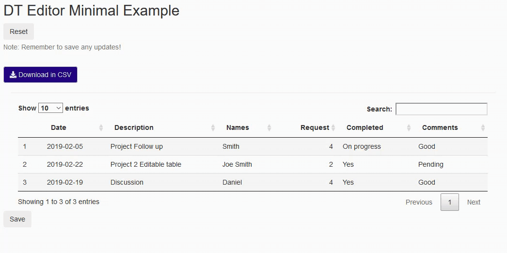

# DT_editable_as_shiny_input
 This is a shiny app to showcase the editable DT tables as shiny inputs and passed as reactives. 
 
 Different from the another DT editable table, users can just double click to edit cells they want. If they accidentally edit cells before save, just click reset button. When it is ready, just click "save" button to permanently save the edited table. 
 
 
